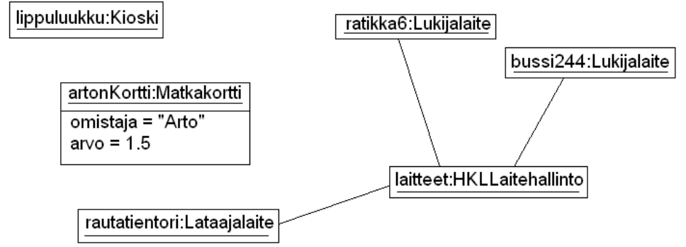

## Tehtävä 1


Metodien paluuarvon tyypin voi halutessaan merkitä myös "javamaisesti": int arvo();

## Tehtävä 2


Jos katsoo koodia, mikään ei estä laittamasta matkalaukkua yhtä aikaa moneen lastiruumaan, siksi yhteyden toisen pään osallistumisrajoite voisi olla myös *. Vastaavasti myös Matkalaukun ja Tavaran suhteen.

## Tehtävä 3


Koodista katsomalla selviää että Lukijalaitteet ja Lataajalaitteet voisivat periaatteessa olla yhteydessä moneenkin laitehallintoon, eli yhteyden osallistumisrajoite voisi myös olla *.

Kioskilla, Lukijalaitteella ja Lataajalaitteella on riippuvuus Matkakorttiin. Laitteet käyttävät metodissa matkakorttia riippuvuus onkin merkitty tarkenteella <<use>>, kioski taas luo matkakortin ja tarkenne on <<create>>. Luokkien olioilla ei ole kuitenkaan pysyvää suhdetta matkakorttiolioihin, normaalia yhteyttä siis ei tule merkitä.

Matkakortti ei riipu eikä ole yhteydessä mihinkään luokkiin sillä koodissa ei ole viitteitä muihin luokkiin

## Tehtävä 4

Oliokaavio joka vastaa tilannetta mainin viimeisellä rivillä



Oliokaavioon siis ei merkitä riippuvuuksia. Yhteyksiin ei tarvita osallistumisrajoitteita koska kyseessä ovat kahden olion väliset yhteydet. Yhteydet voidaan tarvittaessa nimetä.

Huomaa, että olion nimi on alleviivattu ja noudattaa muotoa olionNimi:Luokka

## Tehtävä 5

```java
public class LukutilastoTest {

    private Lukutilasto tilasto;
    private static final double VIRHE = 0.001;

    @Before
    public void setUp() {

        tilasto = new Lukutilasto();
    }

    @Test
    public void lukujenMaaraAluksiNolla() {

        assertEquals(0, tilasto.haeLukujenMaara());
    }

    @Test
    public void summaAluksiNolla() {

        assertEquals(0, tilasto.summa());
    }

    @Test
    public void keskiarvoAluksiNolla() {

        assertEquals(0, tilasto.keskiarvo(), VIRHE);
    }

    @Test
    public void lukujenMaaraKasvaaYhdellaKunLisataanYksiLuku() {

        tilasto.lisaaLuku(5);

        assertEquals(1, tilasto.haeLukujenMaara());
    }

    @Test
    public void lukujenMaaraKasvaaKahdellaKunLisataanKaksiLukua() {

        tilasto.lisaaLuku(5);
        tilasto.lisaaLuku(5);

        assertEquals(2, tilasto.haeLukujenMaara());
    }

    @Test
    public void summaKasvaaLuvullaKunLisataanLuku() {

        tilasto.lisaaLuku(5);

        assertEquals(5, tilasto.summa());
    }

    @Test
    public void summaKasvaaLuvuillaKunLisataanKaksiLukua() {

        tilasto.lisaaLuku(5);
        tilasto.lisaaLuku(2);

        assertEquals(7, tilasto.summa());
    }

    @Test
    public void summaVaheneeJosLisataanNegatiivinenLuku() {

        tilasto.lisaaLuku(5);
        tilasto.lisaaLuku(-2);

        assertEquals(3, tilasto.summa());
    }

    @Test
    public void keskiarvoPalauttaaLuvunKunVainYksiLuku() {

        tilasto.lisaaLuku(5);

        assertEquals(5, tilasto.keskiarvo(), VIRHE);
    }

    @Test
    public void keskiarvoPalauttaaLisatynLuvunJosVainMontaSamaa() {

        tilasto.lisaaLuku(2);
        tilasto.lisaaLuku(2);
        tilasto.lisaaLuku(2);

        assertEquals(2, tilasto.keskiarvo(), VIRHE);
    }

    @Test
    public void keskiarvoJakaaOikeinKahdenLuvunSumman() {

        tilasto.lisaaLuku(5);
        tilasto.lisaaLuku(10);

        assertEquals(7.5, tilasto.keskiarvo(), VIRHE);
    }

    @Test
    public void keskiarvoJakaaOikeinKahdellaNegatiivisellaLuvulla() {

        tilasto.lisaaLuku(-5);
        tilasto.lisaaLuku(-10);

        assertEquals(-7.5, tilasto.keskiarvo(), VIRHE);
    }

    @Test
    public void keskiarvoJakaaOikeinYhdellaNegatiivisellaJaYhdellaPositiivisellaLuvulla() {

        tilasto.lisaaLuku(5);
        tilasto.lisaaLuku(-5);

        assertEquals(0, tilasto.keskiarvo(), VIRHE);
    }
}
```

