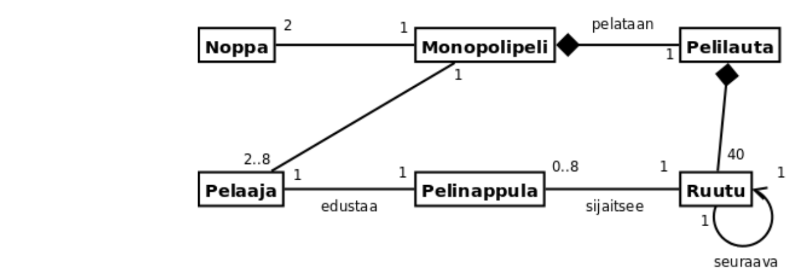
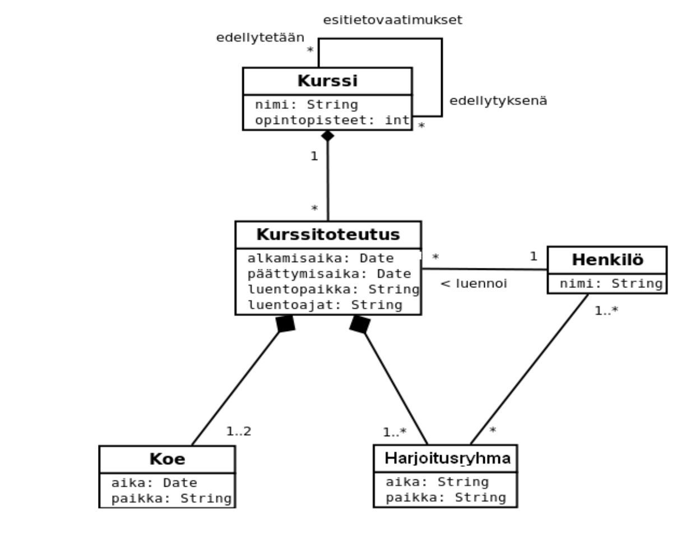
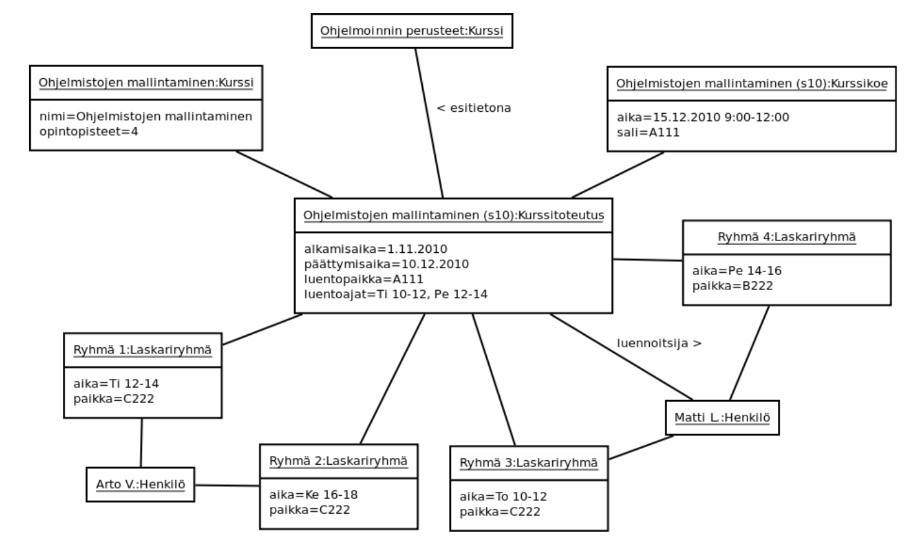
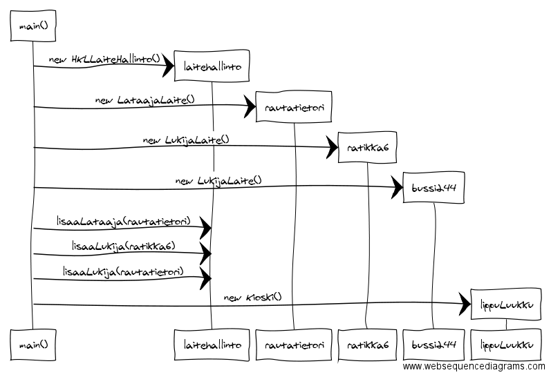
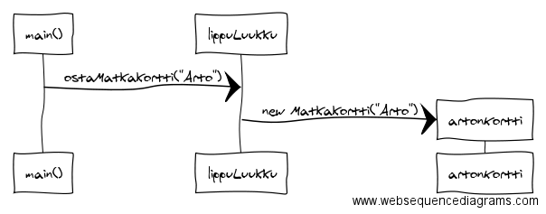
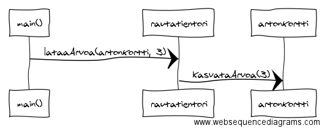
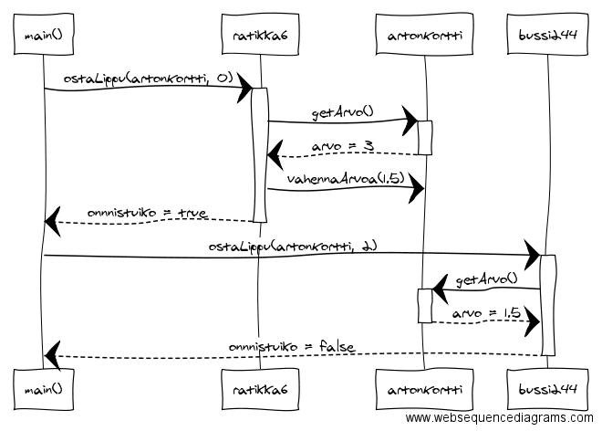
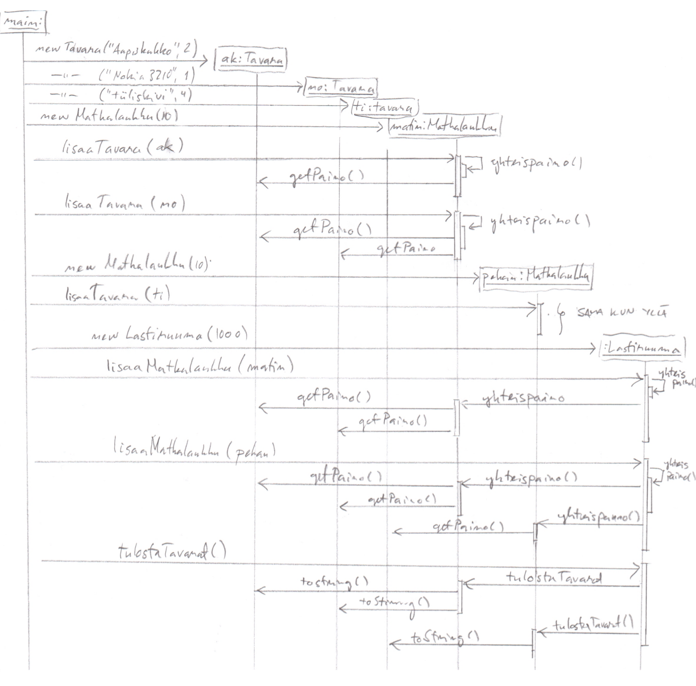

## Tehtävä 1

Tehtävässä 1 mallinnettiin Monopolipeliä. Alla olevassa esimerkissä peliin liittyy aina 2 noppaa, peliä pelataan pelilaudalla, eikä pelilautaa voi olla ilman peliä. Peliin liittyy aina 1 pelilauta. Pelilauta koostuu 40 ruudusta, joista jokainen tietää seuraavan ruutunsa. Pelinappula, joita pelissä on yhteensä pelaajien määrä, sijaitsee aina jollain ruudulla. Pelaajia monopolipelissä on 2-8.



## Tehtävä 2

Tehtävässä 2 tarkasteltiin yliopiston kursseihin, niiden esitietovaatimuksiin, kurssitoteutuksiin ja opettajiin liittyviä tilanteita. Kurssilla voi olla esitietovaatimuksina muita kursseja, ja siitä tehdään kurssitoteutuksia. Kurssilla on siis aina kattokäsite, joka sisältää kurssin nimen ja muita yleisiä tietoja. Kurssitoteutukset taas ovat konkreettisia kurssista pidettäviä luentosarjoja, joihin liittyy muuta tietoa kuten luento- ja laskariajat. Kurssia luennoi 1 henkilö, ja siihen liittyy 1 tai useampi laskariryhmä. Laskariryhmillä on myös aina 1 assistentti – Henkilö. 

Kurssitoteutusta ei voi olla ilman kurssia. Ilman kurssitoteutusta ei ole siihen liittyviä laskariryhmiä eikä kokeita.



***Huomio esitietovaatimuksista:***

Kurssien välinen yhteys esitietovaatimukset on oikeastaan kaksisuuntainen. Tietty kurssi, esim. Ohjelmoinnin jatkokurssi on esitietovaatimus esim. kurssille Tietorakenteet. Ohjelmoinnin jatkokurssilla on esitietovaatimuksena kurssi Ohjelmoinnin perusteet. Kuvassa yksi ”yhteysviiva” siis pitää sisällään kaksi suuntaa. Oikealta vasemmalle tarkasteltaessa liitetään kurssi niihin kursseihin jotka edellytettään suoritetuksi ennen kurssia. Vasemmalta oikealle tarkasteltaessa yhteys taas liittää kurssin niihin kursseihin joihin osallistumisen edellytyksenä sen suoritus on.

## Tehtävä 3

Tehtävässä 3 pyydettiin oliokaaviota tehtävän 2 luokkakaavion pohjalta. Alla esitettynä syksyn 2010 tilanne ohjelmistojen mallintaminen-kurssin osalta.



## Tehtävä 4

Tehtävässä 4 mallinnetaan HKL-tehtävään liittyvää pääohjelmaa. Ohjelma toimii askeltaen kutakuinkin seuraavasti. Luodaan ensiksi ohjelman oliot.



Tämän jälkeen kioskilta ostetaan matkakortti artonKortti, jotka kioski luo.



Kun artonKortti on luotu, arton kortille ladataan arvoa 3 yksikköä.



Seuraavaksi itse logiikka. Ensiksi ostetaan ratikkalippu (hinta 1.50) ratikka6:sta. Arton kortilla on arvoa 3, josta vähennetään 1.50. Seuraavaksi yritetään ostaa seutulippu (hinta 2.10), johon kortilla ei ole varaa.



Yllä olevassa esimerkissä on oletettu että seurataan koodin kulkua. On myös mahdollista mallintaa ohjelma siten, että sekvenssikaavioon mallinnetaan ehto-lohkot ym. Yleensä haarautumista ei kuitenkaan mallinneta eksplisiittisesti.

## Tehtävä 5



## Tehtävä 6

```java
import java.util.ArrayList;
import org.junit.Before;
import org.junit.Test;
import static org.junit.Assert.*;

public class JoukkueTest {

    Joukkue joukkue;

    Pelaaja pelaaja1;
    Pelaaja pelaaja2;

    @Before
    public void setUp() {
        joukkue = new Joukkue("test");
        pelaaja1 = new Pelaaja("matti", 2);
        pelaaja2 = new Pelaaja("arto", 3);
    }

    @Test
    public void nimenHakeminenToimii() {
        assertEquals("test", joukkue.haeNimi());
    }

    @Test
    public void joukkueenKokoOnAluksiNolla() {
        assertEquals(0, joukkue.koko());
    }

    @Test
    public void pelaajanLisaaminenKasvattaaJoukkuenKokoa() {
        joukkue.lisaaPelaaja(pelaaja1);
        assertEquals(1, joukkue.koko());
    }

    @Test
    public void useanPelaajanLisaaminenKasvataaKokoa() {
        joukkue.lisaaPelaaja(pelaaja1);
        joukkue.lisaaPelaaja(pelaaja2);
        assertEquals(2, joukkue.koko());
    }

    @Test
    public void merkkijonolistaOnAluksiTyhja() {
        assertEquals(0, joukkue.pelaajatMerkkijonolistana().size());
    }

    @Test
    public void pelaajaTulostuuMerkkijonolistaan() {
        joukkue.lisaaPelaaja(pelaaja1);
        ArrayList<String> lista = joukkue.pelaajatMerkkijonolistana();
        String tuloste = lista.get(0);
        assertEquals(pelaaja1.toString(), tuloste);
    }
    
    @Test
    public void toinenLisattyPelaajaTulostuuMyosMerkkijonolistaan() {
        joukkue.lisaaPelaaja(pelaaja1);
        joukkue.lisaaPelaaja(pelaaja2);
        ArrayList<String> lista = joukkue.pelaajatMerkkijonolistana();
        String tuloste = lista.get(1);
        assertEquals(pelaaja2.toString(), tuloste);
    }

    @Test
    public void maksimikokoVoidaanAsettaaJaToimii() {
        joukkue.asetaMaksimikoko(1);
        joukkue.lisaaPelaaja(pelaaja1);
        joukkue.lisaaPelaaja(pelaaja2);
        
        assertEquals(1, joukkue.koko());
    }

    @Test
    public void maalienMaaraAluksiNolla() {
        assertEquals(0, joukkue.maalit());
    }

    @Test
    public void maalitLasketaanOikeinKunYksiPelaaja() {
        joukkue.lisaaPelaaja(pelaaja1);
        assertEquals(2, joukkue.maalit());
    }

    @Test
    public void maalitLasketaanOikeinKunKaksiPelaajaa() {
        joukkue.lisaaPelaaja(pelaaja1);
        joukkue.lisaaPelaaja(pelaaja2);
        assertEquals(5, joukkue.maalit());
    }

}


```
