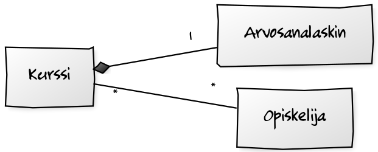
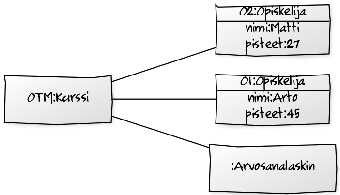
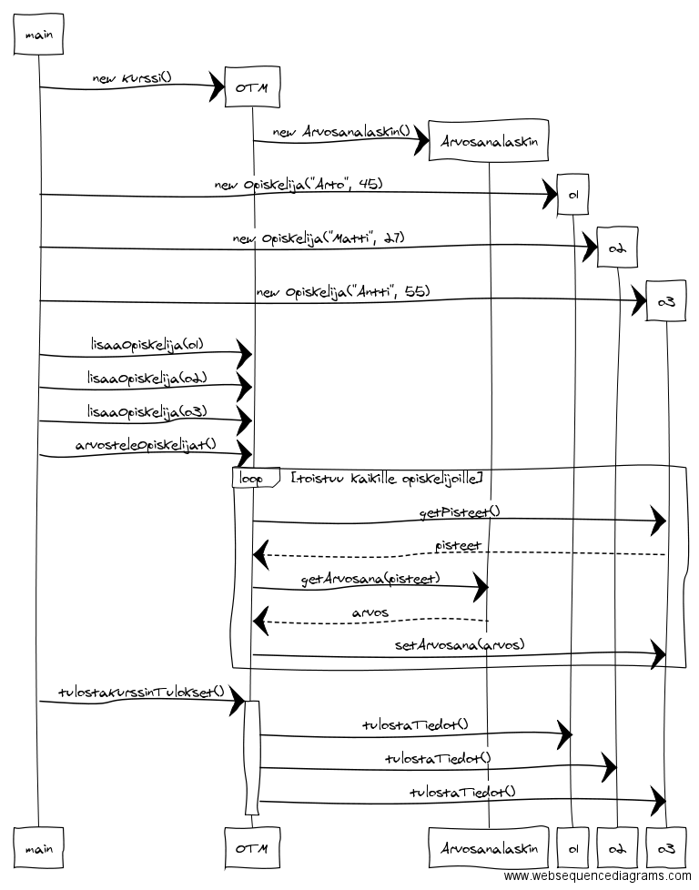
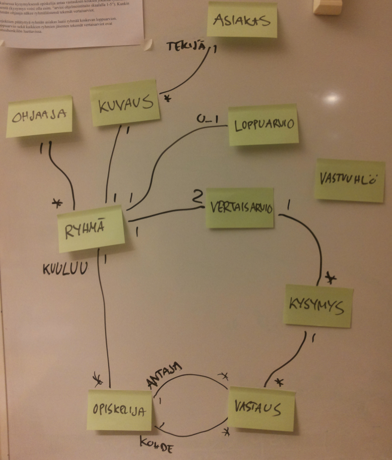
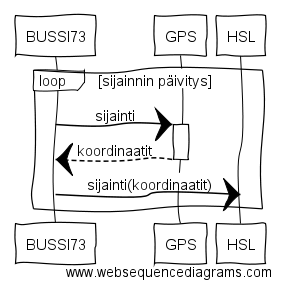
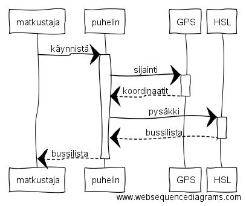
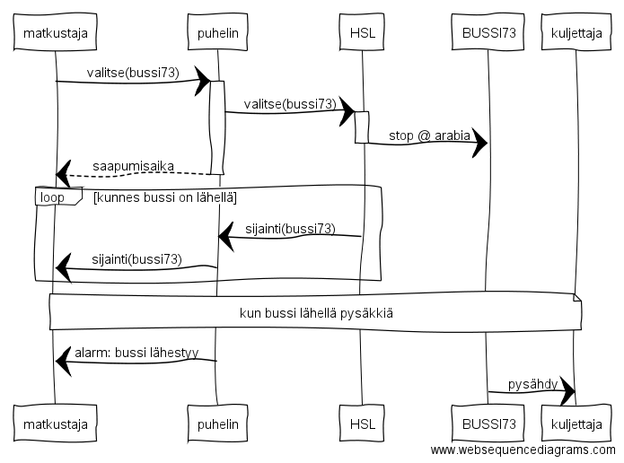

## Tehtävä 1

## Tehtävä 2

## Tehtävä 3

## Tehtävä 4

## Tehtävä 5

**Sekvenssikaavion selkeyttämiseksi tehdään kaavio osissa.**

Bussin sijanti päivittyy HSL:lle **jatkuvasti**:

Bussilista haetaan HSL:tä puhelimen GPS:ää käyttäen:

Asiakas tekee pysäytyspyynnön haluamalleen bussille ja saa ilmoituksen kun bussi on lähellä:

